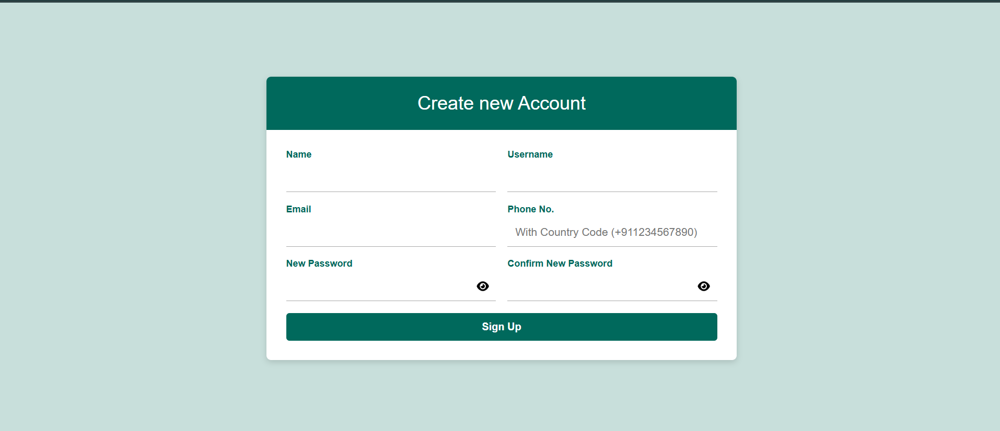
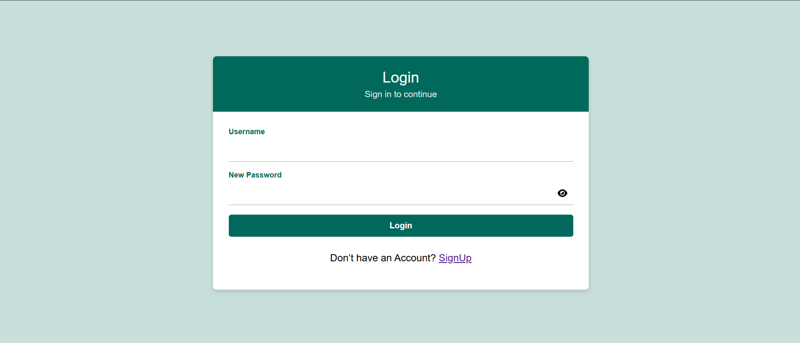

# React Login & Signup App

This is a small React project I made to practice the basics — login and signup flow with proper validations, routing, and a clean UI.  
It’s kept simple but has all the common things you’d expect in a real app like form validations, toasts, and responsive design.

---

# What’s Inside
- Login and Signup screens (both responsive)
- Proper input validations:
  - Name → alphabets only  
  - Username → letters, numbers, and `. _ -`  
  - Password → same rules as username but can’t be the same as the username  
  - Confirm Password → must match password  
  - Email → must be a Gmail ID (`something@gmail.com`)  
  - Phone → must start with country code (e.g. `+91`) and then 10 digits
- Shows error messages right under the fields when you type something wrong
- Toast notifications (success/error) using **React-Toastify**
- Password fields with **show/hide toggle** (FontAwesome icons)
- Reusable components (`Input`, `Button`, `AuthLayout`, `Toast`)
- Navigation handled by **react-router-dom**

---

# Tech Used
- React (create-react-app)
- React Router DOM
- React Toastify
- FontAwesome Icons
- Plain CSS (no heavy UI library, just custom styles)

# Project Structure
src/
┣ components/
┃ ┣ AuthLayout/ → wrapper for login/signup pages
┃ ┣ Button/ → common button
┃ ┣ Input/ → input with label, error & toggle password
┃ ┗ Toast/ → common toast helper
┣ pages/
┃ ┣ Login.js
┃ ┗ Signup.js
┣ utils/
┃ ┗ validations.js
┣ App.js
┣ App.css
┗ index.js

1. Clone this repo:
 
   git clone https://github.com/hemantarora81/react-login-signup.git
   cd react-login-signup

Install dependencies:

npm install
Install extra libraries used:

npm install react-router-dom react-toastify @fortawesome/react-fontawesome @fortawesome/free-solid-svg-icons @fortawesome/fontawesome-free

Start the app:
npm start
Open http://localhost:3000 in your browser.

